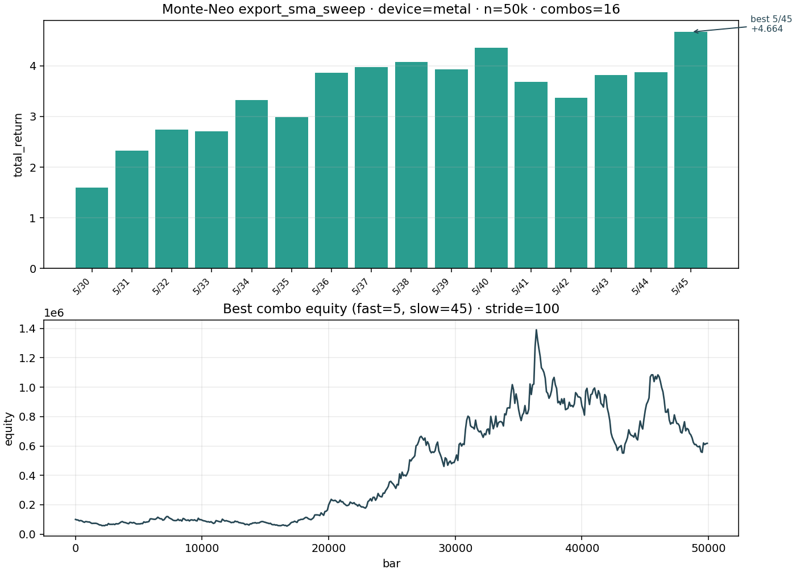
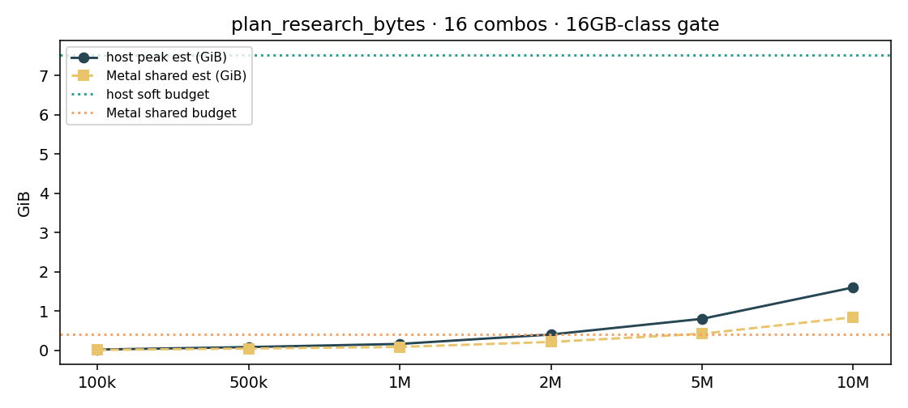

# Monte-Neo

<p align="center">
  
</p>

<p align="center">
  <strong>Fast local research</strong> for trading strategies on Apple Silicon<br/>
  Fee-aware next-bar economics · Monte Carlo · paper OMS<br/>
  MIT · Python 3.11+ · Metal / MLX / Numba
</p>

<p align="center">
  <a href="https://github.com/NeoZorK/Monte-Neo/actions/workflows/ci.yml"></a>
  <a href="https://pypi.org/project/monte-neo/"></a>
  <a href="LICENSE"></a>
  <a href="https://github.com/NeoZorK/Monte-Neo/releases/latest"></a>
  
  
</p>

> Current: **v0.17.3** · [Docs site](https://neozork.github.io/Monte-Neo/) · [Changelog](docs/project/CHANGELOG.md) · [FAQ](docs/guides/FAQ.md)

## What this is (and is not)

**Job:** on Apple Silicon macOS, build and verify trading-domain strategies **very quickly**
with fee-aware next-bar economics you can re-check (export API + golden vectors).

**Lanes:** research bar (primary speed path) · Monte Carlo research · paper OMS (validation).

**Not a goal:** replace full event-driven production / live-bot platforms. Research sweep
throughput is not an OMS event-loop claim.

## Why Monte-Neo

| Advantage | What you get |
|-----------|----------------|
| Local Apple Silicon speed | Metal economics + Numba (MLX optional for signals) |
| Fee-aware research bar | Next-bar fills, costs (bps), SL/TP/trail, funding, sessions |
| Honest export API | `export_single` / `export_batch` / `export_sma_sweep` + golden vectors |
| 16GB-class memory planner | `plan_research_bytes` + **no-hang** Metal size gate → `cpu_numba` fallback |
| Local research triage | `HeuristicPolicy` after export → next action / promote / MC |
| Holdout check | `holdout_sma_sweep` train→holdout gap (anti-overfit, no ML) |
| Clear non-goals | macOS research tool first; paper OMS is a separate lane |
| MIT | Use, fork, and ship without drama |

## Install

**From PyPI (recommended):**

```bash
pip install monte-neo                 # research-core (slim)
pip install "monte-neo[apple]"        # Metal / MLX (Apple Silicon)
pip install "monte-neo[plot]"         # charts
pip install "monte-neo[data]"         # Binance downloader / websocket
pip install "monte-neo[full]"         # kitchen-sink local parity
```

**From git:**

```bash
pip install "git+https://github.com/NeoZorK/Monte-Neo.git"
pip install "monte-neo[apple] @ git+https://github.com/NeoZorK/Monte-Neo.git"
```

**In-repo (contributors):**

```bash
git clone https://github.com/NeoZorK/Monte-Neo.git
cd Monte-Neo
uv sync --extra apple --extra plot --extra data --group dev
```

See [PACKAGING.md](docs/project/PACKAGING.md) · [Export API](docs/api/export.md) · [Policy triage](docs/api/policy.md).

**Requirements:** Python **3.11+**. Best experience on **Apple Silicon** macOS. Numba CPU
paths work more broadly; Metal/MLX are the `[apple]` extra.

## Quick start

```bash
uv sync --extra apple --extra plot --extra data --group dev
uv run monte-neo
uv run pytest tests -n auto
# After an export_sma_sweep JSON:
# uv run monte-neo --policy-triage path/to/export.json
```

### Research export (recommended)

```python
from monte_neo.backtest import (
    ExecutionModel,
    export_sma_sweep,
    synthetic_ohlcv,
)

ohlc = synthetic_ohlcv(100_000, seed=42)
model = ExecutionModel(commission_bps=5.0, slippage_bps=5.0, warmup_bars=50)
out = export_sma_sweep(
    ohlc["open"], ohlc["high"], ohlc["low"], ohlc["close"],
    combos=16,
    model=model,
    device="auto",  # Metal when safe; else cpu_numba (see fallback_reason)
)
print(out["device"], out.get("fallback_reason"), out["combos"])
```

### Single bar backtest

```python
from monte_neo.backtest import (
    ExecutionModel,
    frame_to_ohlc,
    run_bar_backtest,
    sma_signal,
    synthetic_ohlcv,
)

ohlc = frame_to_ohlc(synthetic_ohlcv(5_000, seed=42))
model = ExecutionModel(
    commission_bps=5.0,
    slippage_bps=5.0,
    size_fraction=0.25,
    sl_pct=1.0,
    tp_pct=2.0,
)
sig = sma_signal(ohlc["close"], fast=10, slow=40)
out = run_bar_backtest(
    ohlc["open"], ohlc["high"], ohlc["low"], ohlc["close"], sig, model=model
)
print(out["total_return"], out["metrics"]["max_drawdown"], len(out["trades"]))
```

More: [docs/guides/quick-start.md](docs/guides/quick-start.md) · [backtest engine](docs/project/backtest_engine.md) · [FAQ](docs/guides/FAQ.md)

## How to use (research workflow)

1. Load or synthesize OHLCV (`synthetic_ohlcv` / your frame → `frame_to_ohlc`).
2. Set an `ExecutionModel` (fees, SL/TP, sessions, side mode).
3. Sweep with `export_sma_sweep` / `export_batch`, or a single `export_single`.
4. Check `device`, `signal_device`, and `fallback_reason` when using `auto`.
5. Optional depth: `equity_stride`, journal, `plan_research_bytes` / `memory` on exports.
6. Paper OMS (`monte_neo.oms`) only when you need event-lane validation — not for sweep cps claims.

**Devices:** `auto` · `metal` · `cpu_numba` (and MLX where signal paths allow). Oversized Metal
jobs demote to Numba instead of hanging (v0.14.1+).

## Features (honest)

| Area | Status |
|------|--------|
| MC indicator / robustness workflows | Available via CLI and library |
| Fee-aware research bar engine | `monte_neo.backtest` |
| Research export + golden vectors | `export_*` / `verify_golden_vectors` |
| Memory / no-hang accelerator gate | `plan_research_bytes` / `decide_research_accelerator` |
| Paper OMS + venue adapters | `monte_neo.oms` |
| Metal / MLX / Numba device select | Best-effort on Apple Silicon; CPU fallbacks |
| Docker | Supported for headless/CI-style runs |

## Project structure

```
Monte-Neo/
├── src/monte_neo/
│   ├── backtest/      # Research bar engine + export
│   ├── oms/           # Paper OMS + accel
│   ├── core/          # Generator / Metal bridges
│   ├── data/          # Market data downloaders
│   ├── monte_carlo/   # MC methods
│   ├── metrics/       # Trading metrics
│   ├── cli/           # Interactive CLI
│   └── visualization/
├── tests/
├── docs/
└── docker/
```

## Screenshots / demos

<p align="center">
  
</p>
<p align="center">
  
</p>

More under `docs/assets/`. Runnable script: [`examples/export_sma_sweep_quickstart.py`](examples/export_sma_sweep_quickstart.py).

## Contributing

See [CONTRIBUTING.md](CONTRIBUTING.md) · [docs](docs/development/contributing.md).

## License

MIT — see [LICENSE](LICENSE).

Public repository: https://github.com/NeoZorK/Monte-Neo
