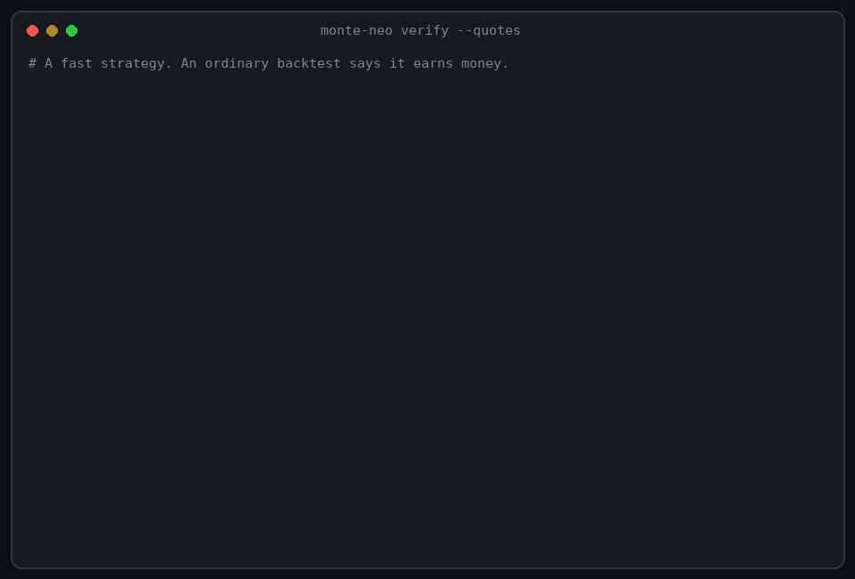

# Latency audit: look-ahead that hides in milliseconds

<p align="center" markdown="1">
{ width="820" }
</p>

A strategy built on intraday bid/ask quotes can look profitable only because the backtest let it act on prices it could not
have known yet. `monte-neo verify --quotes` finds that, tells you at which delay the profit disappears, and puts the answer
in a certificate you can reproduce.

!!! note "Status: experimental"
    The latency checks are context: they warn, they do not fail the verdict (the only `fail` is a strategy that loses money
    after costs even on the plain backtest). They were calibrated on synthetic data. Record real latency on the machine that
    will trade before you trust a number. See [Limits](#limits).

## The problem

A quote has two times: the moment the exchange stamped it and the moment it reached your machine (stamp + latency).

```text
exchange stamp     |-----|-----|-----|-----|-----|
arrival            .  |-----|-----|-----|-----|-----|      (20 ms late, median)
```

A backtest that cuts bars by the **stamp** gives the strategy a bar that closed 10 ms ago, while on a real machine that
bar's quotes are still on their way. A fast strategy then trades on the future of its own information. This is look-ahead,
but no static lint and no truncation probe can see it: the leak is in the clock, not in the code.

## What it catches

| Failure | How it shows up |
|---|---|
| The strategy reacts to a bar before its quotes arrived | `arrival_lookahead` warns: profit on exchange time, a loss on arrival time |
| The edge is thinner than the data delay | `latency_tolerance` warns and names the extra delay in ms where the profit vanishes |
| The profit was lucky latency | `latency_monte_carlo` warns: most redraws of the latency lose money while the observed sample earned |
| The edge lives in instant execution | With `--order-latency-ms` the plain backtest turns into a loss and the verdict is `REJECT` |
| A leader feed arrives after the follower moved (latency arbitrage) | `arrival_lookahead` warns when a strategy that trades one instrument on the move of another earns only on exchange time |
| The strategy reads the future of its own bars (`shift(-1)`) | The look-ahead probes of `verify_strategy` run on the arrival bars and `REJECT` it: this leak exists on every clock |
| Costs ignore the spread | `spread_cost` warns when the modeled slippage is below the half-spread a taker pays |
| The recording itself is unreliable | `quote_quality` warns about crossed quotes, negative latency, rows that did not parse and **bursty latency** |

The last row matters. A congested path (VPN, Wi-Fi, an overloaded router) holds messages back and releases them in bursts.
On a real two-minute recording the latency climbed from 0.5 s to 12 s and then drained in one burst. The check reports
that, instead of letting your network pass as a property of the strategy.

## What it gives you

- A **number you can act on**: "the profit vanishes at 38 ms of extra delay (observed p95 latency 54 ms)".
- A **distribution**, not a single run: 200 seeded redraws of the observed latency, with p5, median, p95 and the probability of a loss.
- A **verdict** in the same `strategy-verdict/1` format as every other certificate, which can be signed and checked with `--recheck`.
- An **HTML report** with a "Time and latency" section and a chart of the return against the extra delay.
- The same result through the **CLI, the Python API and the MCP tool** `verify_quotes`, so an agent can audit its own intraday strategy.

## Try it

```bash
monte-neo verify --demo-quotes                 # no files: a fast strategy and an honest one, on synthetic quotes
```

With your own files (`signal(df)` gets bars of `open, high, low, close, volume` built from the mid price):

```bash
monte-neo verify --quotes quotes.csv --strategy my_strategy.py --bar-ms 1000 \
    --commission-bps 0.5 --slippage-bps 0 --order-latency-ms 20 --html report.html --out cert.json
monte-neo verify --recheck cert.json --quotes quotes.csv --strategy my_strategy.py     # reproduce it
```

The quotes table needs `timestamp`, `bid`, `ask` and the latency as `latency_ms` (or an `arrival` timestamp). The column names
`bid_price`, `ask_price`, `latency` and `ticker` are accepted too. A table of several symbols needs `--symbol`.

```python
from monte_neo.verify import verify_quotes

report = verify_quotes("quotes.csv", strategy="my_strategy.py", bar_ms=1000, symbol="BTCUSDT@BINANCE-FUTURES")
```

## No server near the exchange? Assume the latency

Measuring latency needs a machine near the exchange. Without one you can still ask the question that matters: *how much
latency can this strategy take?* Give the latency yourself (a ping to the server you will rent, a provider's figure), and the
table does not even need a latency column:

```bash
monte-neo verify --quotes quotes.csv --strategy my_strategy.py --bar-ms 100 --latency-model lognormal:8,25   # median 8 ms, p95 25 ms
monte-neo verify --quotes quotes.csv --strategy my_strategy.py --bar-ms 100 --latency-model constant:5
```

The certificate records `latency_model` and says in plain words that the latency is **assumed, not measured**, so the verdict
holds only if the real latency is not worse. The prices stay real: the exchange's own timestamps are exact on any network, only
your receive time is not. Use `latency_scan` (the table of returns against extra delay) to see the whole curve instead of one point.

## Several feeds in one strategy

A strategy may trade one instrument on the prices of another (lead-lag, cross-venue, futures against spot). Select the traded
symbol and the feeds it reads; each feed has its own latency, and its columns are prefixed with the symbol, non-word
characters replaced by `_`:

```bash
monte-neo verify --quotes both.csv --strategy lead_lag.py --symbol LAG@SIM --feeds LEAD@SIM --bar-ms 10
```

```python
def signal(df):                                   # df.close is LAG@SIM, df.LEAD_SIM_close is LEAD@SIM
    return np.sign(df["LEAD_SIM_close"].diff(3).fillna(0.0).to_numpy())
```

On the synthetic pair the follower repeats the leader 30 ms later. With a leader that reaches the machine in 1 to 5 ms the edge
survives; with a leader 30 ms late or more the exchange-time profit turns into a loss on arrival time and `arrival_lookahead` warns.

## Record your own latency

Latency is a property of your machine and your network, so measure it where the strategy will run:

```bash
pip install "monte-neo[data]"
python -m monte_neo.data.quote_recorder --symbol BTCUSDT --seconds 600 --out quotes.csv
```

The recorder takes Binance USD-M futures `bookTicker` quotes and writes the receive time corrected by the clock offset to
the exchange, minus the exchange's event time. The summary says how well the offset is known; when it is only known to
within about 10 ms or worse, the latencies are not trustworthy at that scale and the recorder says so. Run it on a server in
the exchange's region (for Binance futures, AWS Tokyo), not behind a VPN. `E` has millisecond resolution, so latencies are
quantized to 1 ms.

## How to read the output

| Check | Status | Meaning |
|---|---|---|
| `quote_quality` | `warn` | The quotes are not clean: read the summary |
| `net_profitability` | `fail` | The plain backtest loses money after costs: `REJECT`, as in `verify_strategy` |
| `arrival_lookahead` | `warn` | The profit does not survive binning by arrival time |
| `latency_tolerance` | `warn` | One more observed p95 of delay erases the profit |
| `latency_monte_carlo` | `warn` | More than half of the latency redraws lose money |
| any of the three | `skip` | There is no profit to lose: the strategy does not earn on the plain backtest |
| any of the three | `pass` | The profit did not turn negative; `retained` in the details says how much is left (a 15% retained still passes: read it) |

## How it differs from latency-aware backtest engines

| | Latency-aware engines (hftbacktest, NautilusTrader) | Monte-Neo `--quotes` |
|---|---|---|
| Role | A backtest environment: they simulate feed and order latency inside their own engine | An independent audit of a finished strategy |
| Strategy | Written for the engine | Any `signal(df)` function, from any framework or an agent |
| Latency source | Models you configure (constant, interpolated, your own) | The latency you recorded, redrawn per venue |
| Output | Backtest results | A verdict, the ms where the profit vanishes, a certificate others can reproduce |

They solve different problems and work together: simulate in an engine, then audit what comes out. [hftbacktest](https://hft.readthedocs.io/en/latest/latency_models.html)
and [NautilusTrader](https://nautilustrader.io/docs/core-latest/nautilus_execution/models/latency/trait.LatencyModel.html)
document their latency models. To our knowledge, no other independent verifier checks arrival-time look-ahead.

## Limits

- **Experimental.** The checks warn and do not fail the verdict; the honest-strategy controls (several seeds, three latency levels and an order delay) ran on synthetic data.
- **One traded instrument per run.** Pick it with `--symbol`; other feeds are read through `--feeds`. A strategy that trades several instruments at once is not supported.
- **Information latency plus a fixed order delay.** `--order-latency-ms` delays every fill by a constant. **Queue position and partial fills are not modelled, on purpose:** they need the order book and the trade prints and a passive-order model, and a rough formula would give false precision. Fills are taker orders at the mid; use a latency-aware engine such as hftbacktest for market-making strategies. Every certificate lists these assumptions in `assumptions`.
- **Bars from the mid price.** The strategy sees `open, high, low, close` of the mid and `volume`, the count of quotes.
- **The strategy file runs with your permissions,** as with `verify_strategy`; the `--isolate` sandbox does not apply to `--quotes` yet.
- **The look-ahead probes run on the arrival bars** (`--no-probes` skips them), so a strategy that reads the future of its bars is caught; the statistical checks of `verify_strategy` (Deflated Sharpe, timing test) do not run.

## Checked on real quotes

`scripts/validate_on_real_quotes.py` runs the checks on real recordings. The run behind these numbers used 15 minutes each of
Binance USD-M futures BTCUSDT, ETHUSDT and SOLUSDT (1.18 million real quotes, 1 October 2026), recorded on the author's own
network. The prices and exchange timestamps are real; that network is too congested to trust its latency, so every run
*assumed* a latency (`lognormal:5,15`, `lognormal:20,60`, `constant:50`) with costs of 0.2 bps commission + 0.3 bps slippage.

| What ran | Result |
|---|---|
| 36 honest strategies (3-bar trend, mean reversion, breakout, fast momentum; 3 recordings; 3 latency scenarios) | 0 rejected for any reason other than losing money; 33 rejected because they lose money after costs, 3 passed (BTC breakout, +0.01%) with no latency warning |
| Foresight control (`shift(-1)`) on each recording | 3 of 3 rejected by `lookahead_truncation` |
| A real pair, ETH traded on the move of BTC (100 ms bars) | Loses money after costs: nothing to audit |
| An edge planted on the real SOL price path: a follower that repeats it 2 s later | Passes at 20 to 500 ms of latency, `latency_tolerance` warns at 1.5 s, `arrival_lookahead` warns at 2.5 s (+2.08% on exchange time, -1.64% on arrival time) |

How to read it, honestly: on real prices there was almost no honest edge to audit, which is what an independent verifier
should report. The latency checks fired only where the ground truth was planted (the 2 s lag), and at the delay that matches
it. What this does **not** show: how often the warnings accuse an honest strategy that really earns, because only three honest
runs earned anything. Fifteen minutes of one day is a smoke test, not a study. Run the script on your own recordings.

## Speed

Measured on an Apple M1 Pro with synthetic quotes and a three-bar trend rule: 1 million quotes load in 0.6 s and `quote_quality`
takes 0.06 s; the whole `verify_quotes` takes 1.3 s with 20 latency draws on 1 s bars, 7 s with 200 draws on 100 ms bars
(100 000 bars) and 11 s on 20 ms bars (500 000 bars). The cost is the strategy's own `signal(df)`, run once per draw.

## Further reading

- [API reference](../api/verify.md#quotes-and-arrival-time-verifyquotes-verifyarrival)
- [Trap Suite](trap-suite.md): the arrival traps and honest controls live in `tests/traps/test_quote_traps.py`
- [Use from agents](agents.md): the MCP tool `verify_quotes`
